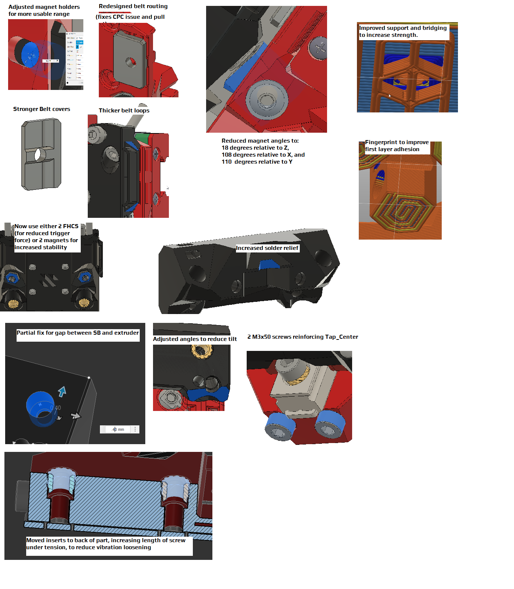
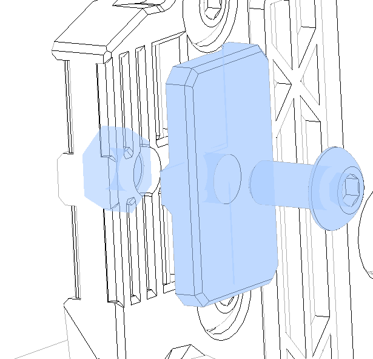
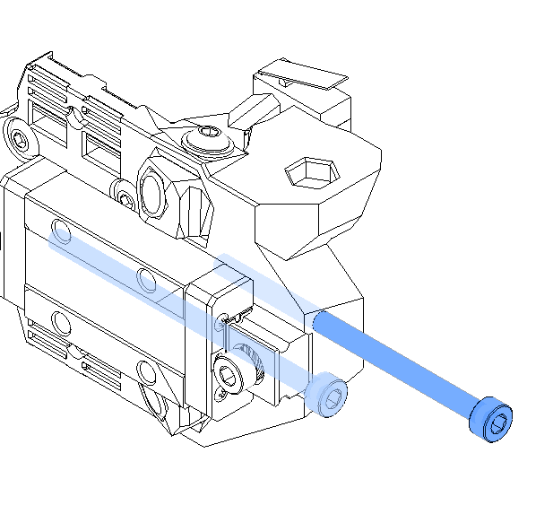
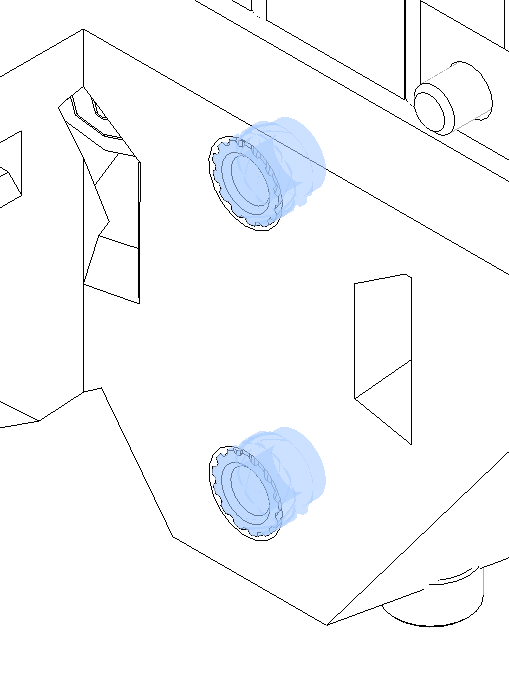
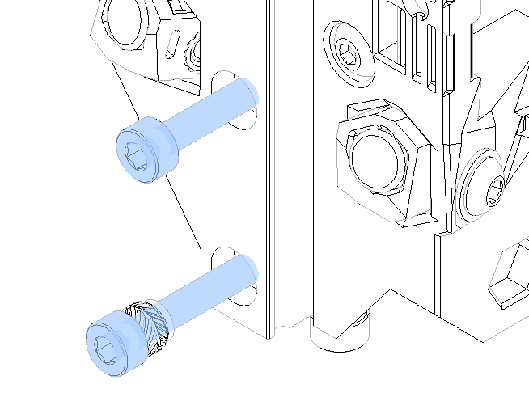

TAP RC8 Errata, notes, etc

Welcome to Tap RC8.  This is a full reprint from Tap RC6.

*Wait! What happened to RC7? the last thing you published was RC6!*  
RC7....didn't make it.  From its ashes, RC8 arose.  As we all know, eight is great.  
  
Here's what changed:

One of the big changes is you can now use either a pair of magnets or a pair of FHCS in Tap_front.  The stronger the pull force, the more resistant to ringing, but also the more potential to marring your Build surface.  
  
here are my reccommendations.  this is a guideline only, your mileage may vary, caveat emptor, barba crescit caput nescit.

| Build surface | Trigger force (approx) | Configuration | Max Accels |
|---------------|------------------------|---------------|------------|
| Flat PEI sticker | 750 g | 2 N35 magnets + 2 FHCS | 5000 mm/s^2 |
| Powder coat PEI | 1400g | 4 N52 Magnets | 10000 mm/s^2 |

  
  
Other than possibly wanting more or stronger magnets, here's what you will need in addition to the original Tap BOM:

| Qty | Description | Notes |
|-----|-------------|-------|
| 2 | M3x50 BHCS or SHCS | Threaded the entire length. you can get by without these, or with M3x40's.  |
| 1 | M3x16 SHCS | Replaces a M3x12 SHCS securing the rail. |
| 2 | M3x8 BHCS | Used with belt covers |
| 2 | M3 nuts | Used with belt covers |
| 2  | M3 washers | Used with belt covers |
| 11-12 | M3 Heatset inserts | This depends on your ability to reclaim heatsets from the existing parts.  If you can, you won't need any additional heatsets. |

  
Belt handling:  
The belts are now handled by looping around Tap_center, and secured with a printed belt cover and M3x8 BHCS:

  
  
  
the 2 M3x50 bolts are threaded up into Tap_Center, and serve to provide extra stiffening:

  
  
  
The heatset inserts for the center are moved back 4 mm to provide extra vibration resistance:

  
  
  
So they will need to be secured with M3x12 and M3x16 SHCS:

(The top is still secured by M3x6 SHCS)

Enjoy!