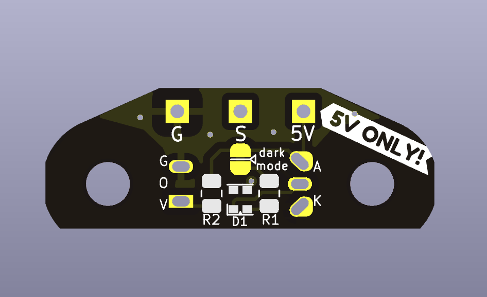
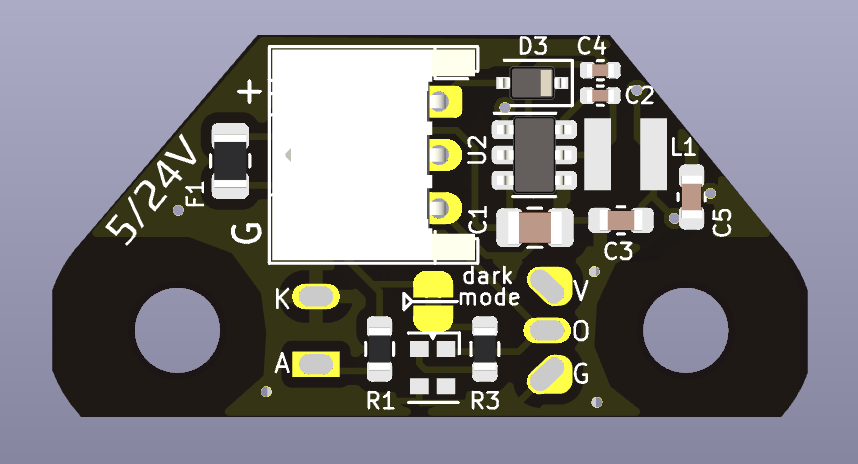

# OptoTap PCB

OptoTap PCB is a small, completely unnecessary PCB that exists to make installation of the optical sensor marginally more convenient. (That's right, several of us have spent dozens of hours and hundreds of dollars in order to avoid two solder joints and a bit of heat shrink.)

It comes in two official flavors/form factors:

- **V1**: smaller form factor, 5V only
- **V2**: taller form factor, 5-24V capable

Both simplify optical sensor installation by including the necessary current-limiting resistor for the IR led within the sensor itself, as well as providing a visible LED indicator to assist with troubleshooting. 

The V1 board attempts to minimize size and cost as much as possible, at the expense of some flexibility: it **can not be used as a drop-in replacement for 24V inductive sensors** (24V will fry the optical sensor, eventually.)

The V2 board adds a switch-mode regulator to allow safely connecting to 24V probe headers. The regulator converts positive input voltage between 5 and 24V to 5V on-board, at the expense of some additional components and a larger PCB. 

## OptoTap V1

This version saves some vertical room by requiring you to solder your connector wires directly to the board. 

**Do not connect this version to 24V!** (Did we mention that *it's not 24V tolerant???*) Many of the Voron toolhead PCBs in circulation send 24V to the three-pin probe header. You cannot plug this board directly in to these headers!

### Revision history 

- 1.0: initial release

## OptoTap V2

This version uses an AP63205WU switch mode regulator to drop input voltage and supply 5V to the sensor. This gives a bit of additional room to add a JST-PH 2.0mm pitch connector as well [part number S3B-PH-K-S (LF)(SN)].

You can safely connect voltages from 5V to 24V to this board. 

### Revision history

- 2.0: initial prototype
- 2.1: component modifications after initial testing
  - changed C1 to higher voltage rating
  - changed C2 bootstrap cap to higher capacitance
  - changed all capacitors to 0805 for better part availability

