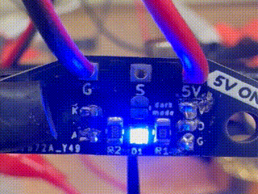

# OptoTap PCB

OptoTap PCB is a small, completely unnecessary PCB that exists to make installation of the optical sensor marginally more convenient. (That's right, several of us have spent dozens of hours and hundreds of dollars in order to avoid two solder joints and a bit of heat shrink.)

It comes in two official flavors/form factors:

- **V1**: smaller form factor, 5V only
- **V2**: taller form factor, 5 or 24V capable

Both simplify optical sensor installation by including the necessary current-limiting resistor for the IR led within the sensor itself, as well as providing a visible LED indicator to assist with troubleshooting. 

The V1 board attempts to minimize size and cost as much as possible, at the expense of some flexibility: it **can not be used as a drop-in replacement for 24V inductive sensors** (24V will fry the optical sensor, eventually.)

The V2 board adds a switch-mode regulator to allow safely connecting to 24V probe headers. The regulator converts positive input voltage between >5V and 24V to 5V on-board, at the expense of some additional components and a larger PCB. **Please read important information about previous versions of this board below.**

## OptoTap V1

This version saves some vertical room by requiring you to solder your connector wires directly to the board.

**Do not connect this version to 24V!** (Did we mention that *it's not 24V tolerant???*) Many of the Voron toolhead PCBs in circulation send 24V to the three-pin probe header. You cannot plug this board directly in to these headers!

### Revision history 

- 1.0: initial release
- 1.3: updated release
	- hybrid footprint to permit use of EE-SX398 sensor in addition to Optek versions
	- two-color LED to indicate status and assist with troubleshooting.
	- 'Dark Mode' solder jumper to allow turning off indicator LEDs
	- increased thermal relief on solder pads to make through-holes easier to solder

## OptoTap V2

This version uses an AP63205WU switch mode regulator to drop input voltage and supply 5V to the sensor. This gives a bit of additional room to add a JST-PH 2.0mm pitch connector as well [part number S3B-PH-K-S (LF)(SN)].

**IMPORTANT NOTE: The original version of this board had an issue that rendered it unsafe for use at 24V**. Please see [this issue](https://github.com/VoronDesign/Voron-Tap/issues/42#issuecomment-1370065351) for more extensive details on the testing and resolution of the problem. 

The current version (V2.4) fixes the inrush overvoltage spike that plagued the initial release, and adds several additional safeguards, including a polyfuse and a reverse polarity protection diode. 

### Revision history

- 2.0: initial prototype
- 2.1: component modifications after initial testing
  - changed C1 to higher voltage rating
  - changed C2 bootstrap cap to higher capacitance
  - changed all capacitors to 0805 for better part availability
- 2.4: updated release
  - added polyfuse to limit overcurrent and damp inrush current-induced voltage spike on hot-plugging
  - added reverse polarity protection diode 
  - increased size of inductor to prevent coil saturation
  - added a second output filter capacitor to reduce output voltage ripple
  - hybrid footprint to permit use of EE-SX398 sensor in addition to Optek versions
  - two-color LED to indicate status and assist with troubleshooting.
  - 'Dark Mode' solder jumper to allow turning off indicator LEDs
  - added 5V/24V selection solder jumper on rear of board to allow for easy bypassing of voltage regulator circuit
  - increased thermal relief on solder pads to make through-holes easier to solder

## Indicator LEDs

The revised boards (V1.3/2.4) now have two-color indicator LEDs to help assist with troubleshooting. This should hopefully help a little bit with troubleshooting. The expected behavior of the LED is:

- Blue: Connected to power, beam not broken
- Red: Connected to power, beam broken

When installed in the toolhead, the light should be red normally (toolhead in 'down' position) and blue when activated (toolhead in 'up') position.

I would suggest powering on the board with 5V prior to installing it to make sure everything is functioning as expected. If the indicator LED is red with nothing blocking the optical sensor beam path, there is probably a problem with the ground and signal wires -- triple check!

## Sensor Choice

### Omron or Optek

The revised versions of the boards (V1.3 and V2.4) feature a hybrid optical sensor footprint that permits installation of the Omron EE-SX398 sensor in addition to the Optek OPB666/9xx versions. In testing, the Omron sensor performed just as well as the Optek sensor. 

However, it has a *slightly* different footprint than the Omron sensor, with annoyingly-close leads on the three pin side. I went through a few iterations of testing to come up with a hybrid footprint that seems to work well for either sensor model.

The slots mean there is a little play in sensor positioning, particularly with the EE-SX398 sensor. To help ensure precise alignment with this sensor, print out the jig included in the [STLs]('./STLs') folder.

### Sensor Logic

The Tap setup requires a *buffer* style circuit rather than an *inverter* style to ensure safe operation. This style causes the sensor to trigger (pull the signal pin low) when the toolhead is in its normal, 'down' position. That means that if there is a bad connection somewhere, the MCU can observe that there is a problem *without* crashing the toolhead uncontrollably into the build plate.

Please double check your sensor part number to make sure you're getting the appropriate model!

#### For Omron:

- **Good**:
  - EE-SX398
- **Bad**: 
  - EE-SX498

#### For Optek:

- **Good**: 
  - OPB666N
  - OPB9x1
- **Bad**:
  - OPB9x2

Additionally, for the Optek probes, the OPB9x0 sensors are totem pole rather than open collector, meaning that they will pull the sense pin up to 5V when not pulling it down to GND. This can cause problems for some boards (notably RP2040-based CAN toolhead boards) that do not have 5V-tolerant endstop pins.

	