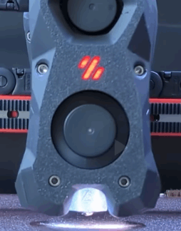

# Voron Tap

> Animated image courtesy of [Maple Leaf Makers](https://github.com/MapleLeafMakers) , see the whole video at https://www.youtube.com/watch?v=mz5qcOZgXhI

Tap is a nozzle-based z-probe for the V2 and Trident printer designs. The entire toolhead moves to trigger an optical switch. Tap offers many advantages:

* Extreme precision 0.4μm (0.0004mm)
* Any build surface and easily change at will
* Durability via optical sensor (millions of probe cycles)
* High temperature reliability (70C to 100C)
* Simplified probe mechanics (no dock/undock macros)
* No separate Z-endstop required
* Crash protection

## Requirements

* Bed must be stable for probing force of 500-800 grams
  * Switchwire, V1.8, Legacy, V0 beds are NOT rigid enough
* Mounts to MGN-12H X-axis
* Front mounted extruder (Clockwork2, LGX, Galileo)
* Accuracy depends on good mechanical condition
* Must have 5V at toolhead or special 24V sensor PCB

## Instructions

Comprehensive assembly details are available in the [Manual](Manual/Assembly_Manual_Tap.pdf)

## Post-Install Setup

1. Update your `printer.cfg` as recommended in [Tap Klipper Instructions](config/tap_klipper_instructions.md)
2. Home Z and test virtual Z endstop by lifting tool-head
3. Heat soak your machine and run a couple `probe_accuracy samples=100` to "break-in" your probe
4. Run a few more `probe_accuracy` checks (default of 10 probes)

For well-built machines you can expect to see between 0.0000 and 0.0008 standard deviation.

## FAQs

* Will Tap hurt my print surface? No, probing temp is restricted to 150C. The team recommends spray coated spring steel. Users of smooth PEI may find minor burnish marks if continously probing the same spot.
* Will the hartk 2-piece PCB work with Tap? Yes, but it requires a slight modification. See discord pin.
* Can I use an optical sensor not specified in the BOM? Not recommended, the team spent considerable time validating sensors in [BOM](BOM.md).
* Can I use micro-switch instead? Not recommended, but check here for more details: [Unklicky Tap](https://github.com/majarspeed/Unklicky/tree/main/Unklicky_TAP)
* Can I use Tap with kinematic bed mounts? Yes, if your bed is rigid up to 800 grams of force.
* Doesn't this add a lot of weight? The team explored many designs and landed on ~50 extra grams as good trade-off between rigidity and weight.
* Why do I need this if my induction probe works fine? Tap enables a far better user experience as it eliminates most baby-stepping needed due to thermal expansion, nozzle & bed surface changes.
* Is Tap noticably more accurate than klicky? Yes.

## (Bonus Points) Data Science

Tap engineering is backed by data science. If you want to dive deeper check out the following resources:

* [Voron:LIVE! Voron Tap announcement stream](https://www.youtube.com/watch?v=JLUDLJQXZeU)
* [Probe accuracy across thermal envelope](https://github.com/KiloQubit/probe_accuracy)
* [Repeatability at individual corners](https://github.com/sporkus/probe_accuracy_tests)

