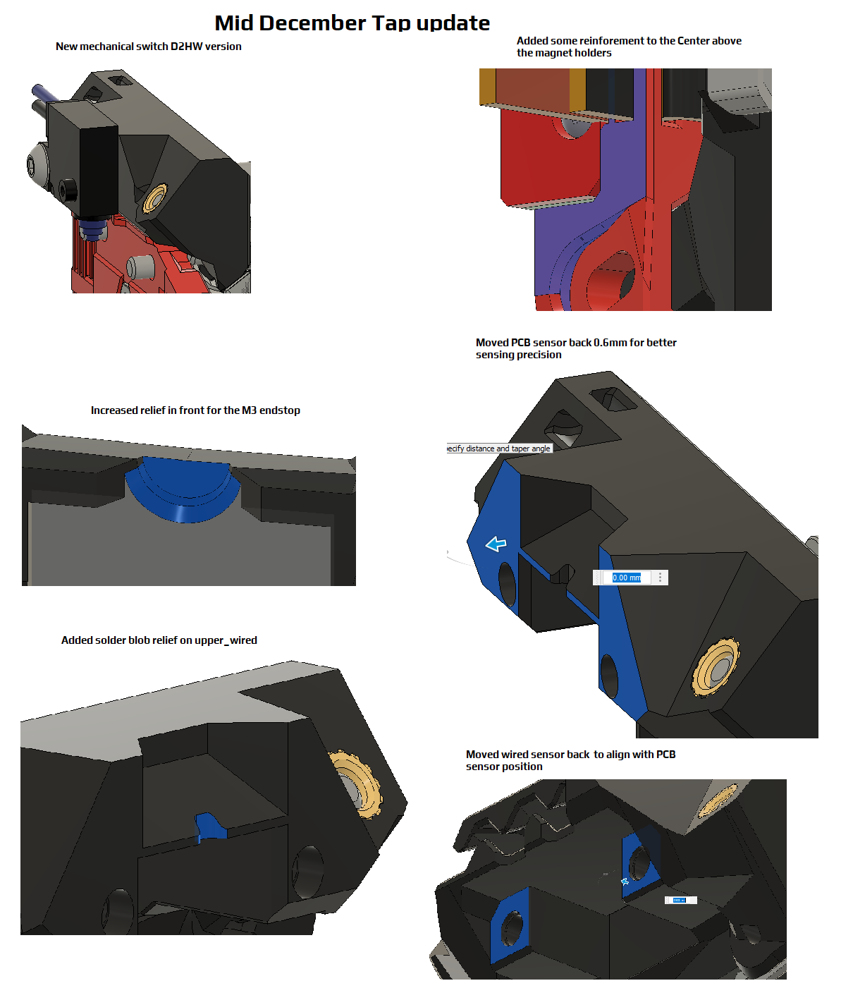

The scope of this file is to summarize any stl changes after the initial release files (r1)
Important note:  When a change is made it is normal for only a few parts to change, or a single part to change.  For parts that don't change, we do not increment revision numbers.
As a result of this, the revision numbers of the most current parts may not match.

11/28/2022
[a]Tap_Center_r2: fixed a minor issue in the MGN12H chamfer that would cause some MGN12H carriages to not fit properly (issue 15)
https://github.com/VoronDesign/Voron-Tap/issues/15

11/29/2022
[a]Tap_Center_r3: re-added in the support structure that went missing at [a]Tap_Center_r2

12/16/2022
[a]Tap_Center_r4: reinforced area above magnet holders
Tap_upper_D2HW_r1: new variant for switch
Tap_upper_PCB_r2: minor changes to optical sensor location for better trigger
Tap_upper_wired_r2: repositioned sensor to same location as PCB
Tap_front_r2: increased clearance to M3x12 endstop

